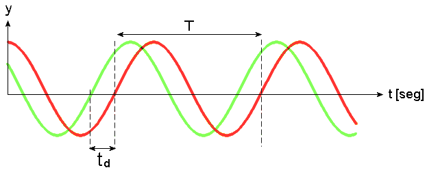

# Apunte clase 11/08/2023

Kenny Vega Obando 2019162050 	

## **Capa Física**

La capa física es la primera capa en el modelo OSI (Open Systems Interconnection), se encarga de la transmisión de bits a través del medio de transmisión físico, como ondas de radio, ofibra óptica o cables de cobre. Su principal función es convertir los datos binarios en señales eléctricas, ópticas o electromagnéticas que puedan ser transmitidas a través de los medios físicos y luego recuperar esos bits en el extremo receptor, permitiendo que los dispositivos se comuniquen de manera efectiva y confiable a través de diversos medios de transmisión.

### **Señales electromagneticas** 

En esencia, las señales electromagnéticas son generadas por dispositivos emisores y luego transmitidas a través de cables, fibras ópticas o el aire (en caso de redes inalámbricas) hasta llegar a dispositivos receptores que las interpretan para recuperar la información transmitida.

Los datos enviados pueden ser análogos o digitales: 

- Señales Digitales: Son representaciones de información que toman valores discretos en intervalos de tiempo específicos. Las señales digitales representan información en forma de bits (0s y 1s). Las señales digitales son una forma efectiva y versátil de representar información en sistemas electrónicos y de comunicación, proporcionando ventajas en términos de precisión, resistencia al ruido y eficiencia en la transmisión y el procesamiento de datos.
- Señales Analógicas:  Son representaciones continuas de información que varían de manera suave y gradual a lo largo del tiempo. A diferencia de las señales digitales, que toman valores discretos en intervalos específicos de tiempo, las señales analógicas pueden tomar cualquier valor dentro de un rango continuo, pueden ser más susceptibles al ruido y a las interferencias en comparación con las señales digitales, tienen una importancia significativa en muchas aplicaciones del mundo real donde se valora la variación suave y la continuidad en la representación de los datos.

 

    

### **Caracteristicas de las ondas:**

- Amplitud: Es la altura máxima de su oscilación, va directamente relacionada con la potencia de la señal.
- Longitud de Onda: La longitud de onda es la distancia entr en dos crestas sucesivas de una onda. 
- Frecuencia: Es el número de ciclos completos que una onda realiza en una unidad de tiempo esta se mide en Hertz (Hz), 1 Hz = ciclo/s.
- Periodo: Es la duración de un ciclo completo, es el tiempo necesario para que la onda pase por un ciclo, es decir, desde una cresta hasta la siguiente cresta
- Fase: Relación entre dos o más señales que comparten la misma frecuencia, mismo ciclo, misma longitud pero estas no se encuentran alineadas. 
- Ciclo / Oscilación: Recorrido desde que inicia una oscilación, hasta que vulve a la posición inical. 

### **Transmicion mediante cambio de fase**

En este enfoque, la fase de una onda portadora se ajusta en el timpo ligeramente presentando una diferencia de fase para representar información, si bien es eficiente en términos de ancho de banda, los dispositivos necesarios para esta técnica pueden ser costosos debido a su complejidad.
 
- 

### **Deterioro de la transmisión**

Es cuadno una señal o información que se envía a través de un medio de comunicación sufre cambios, distorsiones o pérdidas durante su recorrido desde el transmisor hasta el receptor. 
Esto puede ser causado por diversas razones y puede afectar la calidad y la integridad de la señal transmitida, algunos de los factores que contribuyen al deterioro de la transmisión son:

- Atenuación: La atenuación es la disminución gradual de la amplitud de una señal a medida que viaja a través de un medio, cuanto más largo sea el camino de transmisión, mayor será la atenuación, esto puede resultar en una señal debilitada y menos clara en el receptor.
- Distorsión: La distorsión ocurre cuando las diferentes componentes de una señal se retrasan o atenúan de manera desigual, causando que la señal se distorsione en el receptor, esto puede resultar en cambios en la forma de la señal y en la pérdida de detalles importantes.
- Ruido: Es la interferencia no deseada que se superpone a la señal durante la transmisión. Puede ser causado por fuentes externas, interferencia electromagnética u otros factores, puede dificultar la decodificación correcta de la señal en el receptor.

### **Transformada de Fourier**

Es una herramienta matemática fundamental en el análisis de señales y sistemas, se utiliza para descomponer una función en sus componentes frecuenciales, permite analizar una señal en términos de las diferentes frecuencias que la componen. 
En lugar de ver una señal en el dominio del tiempo, donde se muestra cómo cambia con el tiempo, la Transformada de Fourier la representa en el dominio de la frecuencia, mostrando las frecuencias presentes y sus amplitudes, es una herramienta esencial para entender patrones y características en las señales, también permite reconstruir una señal a partir de su espectro de frecuencia utilizando la Transformada Inversa de Fourier.

### **Medios de transmisión guiados**

Son aquellos que proporcionan una vía física para la transmisión de señales y datos entre dispositivos, estos medios ofrecen una estructura física que guía las señales a lo largo de un camino específico

- Par Trenzado: Los cables de par trenzado consisten en dos alambres conductores entrelazados que forman un par, vienen en varias categorías, como Cat 5, Cat 6, etc. Son comunes en redes Ethernet y telefonía
- Medios magneticos: Estos medios permiten grabar información en forma de patrones magnéticos y luego leer esos patrones para acceder a los datos almacenados, de esta manera se puede transportar físicamente la cinta o los discos al sitema destino, este medio otorga un muy buen ancho de banda pero con un tiempo de transporte o transferencia alto. 
- Fibra Óptica: Las fibras ópticas utilizan pulsos de luz para transmitir información, permiten velocidades de transmisión muy altas y son ampliamente utilizadas en redes de alta velocidad y comunicaciones de larga distancia.